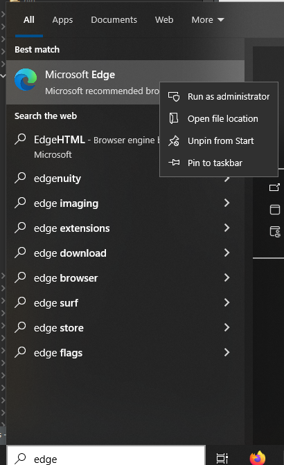
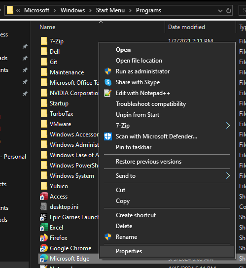
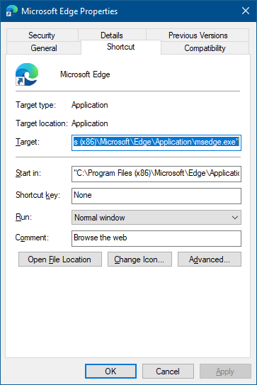
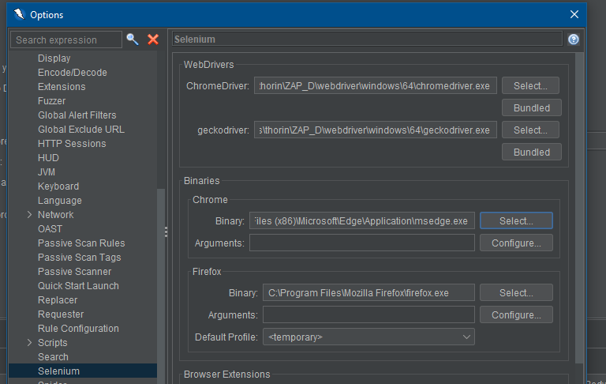

# Use Edge (chromium) instead of Chrome

Since Edge on Windows is now chromium based, you can choose to set your "Chrome" binary as "Edge" if you have a requirement for testing/exploring things with Edge (ex: in a corporate environment).

> [!CAUTION] 
> While this tip might be handy for exploring an app manually it probably IS NOT a good move to set Edge as Chrome for the purposes of the Ajax Spider or DOM XSS rule.

## Setup Process

1. Get Edge's location. Hit the start menu and type "Edge".
2. Right click the start menu entry and hit "Open file location":

3. Get the properties for the Edge shortcut:

4. From the shortcut properties copy the "Target" value:

5. Go back to ZAP and into the Selenium options:
6. Set the Chrome binary location to point to the Edge executable path you copied earlier.

7. Then when you launch a 'Chrome' browser (either via the toolbar button or manual explore screen), it will launch Edge.
8. Note: You may get a message saying the "Provided browser was not found" when you close Edge :shrug: (just click "Ok" and ignore it.)
